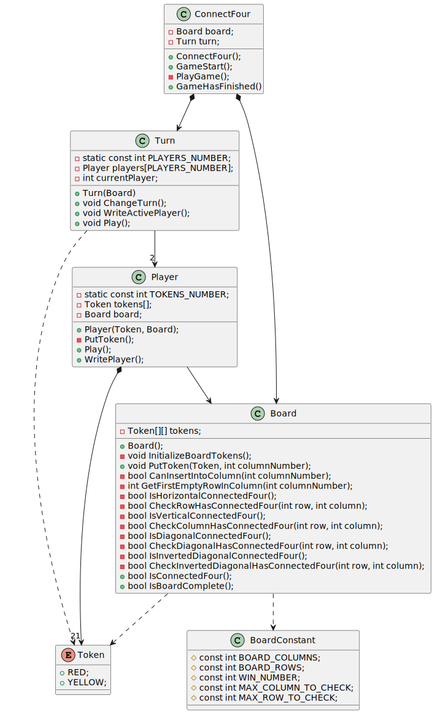
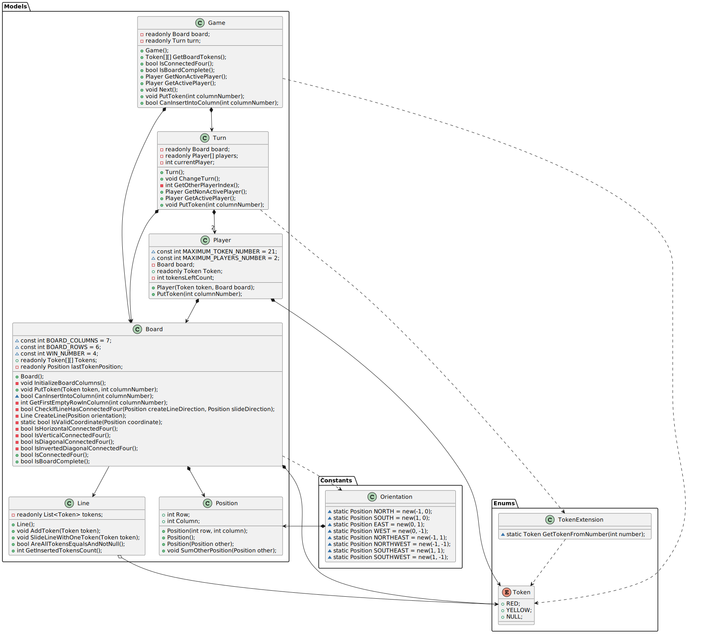
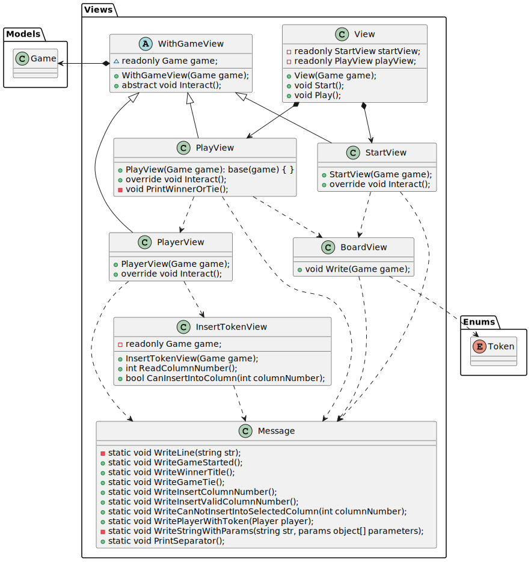

# IWVG-ConnectFour
Connect Four console app for IWVG of Web Engineering Master

# Authors
[Bate Ye](https://github.com/WolfYe98/)

[Raúl Fernández Almendros](https://github.com/ruliworst)

## Domain model

## First Approach UML

# Model-View

## Principal Package UML

## Package Models UML

## Package Views UML
